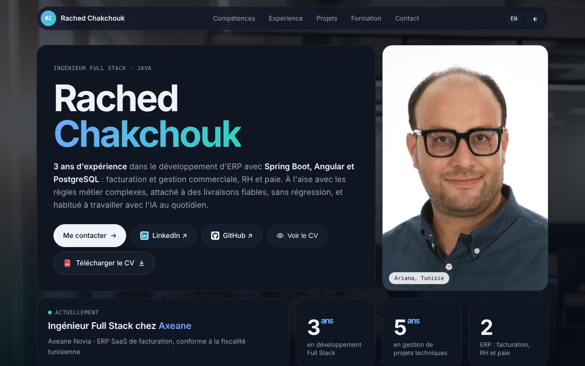

# Rached Chakchouk — Portfolio

**Full Stack Software Engineer · Java / Spring Boot / Angular**

🔗 **Live:** https://rached-chakchouk.netlify.app



## About

Personal portfolio presenting my experience building ERP and business applications
(invoicing, Tunisian taxation, HR & payroll) with **Java, Spring Boot, Angular and PostgreSQL**.

## Features

- Bilingual **French / English** switch
- **Light / dark** theme (follows the system preference, choice saved locally)
- Experience timeline, interactive **projects** section with filters and detail modal
- **Online resume viewer** (FR / EN) and PDF download
- Contact form with front-end validation (ready to connect to Formspree or a REST API)
- Responsive from 375 px to large screens, keyboard accessible, respects `prefers-reduced-motion`

## Tech

Plain **HTML, CSS and vanilla JavaScript** — no framework, no build step, fast to load.
Fonts: Geist (Google Fonts). Technology icons: [Devicon](https://devicon.dev) and [Simple Icons](https://simpleicons.org).

## Structure

```
index.html            # the whole site (markup, styles, scripts)
Rached_Chakchouk_CV_FR.pdf / _EN.pdf
cv/                   # resume pages for the online viewer
bg/                   # background images
favicon-32.png, apple-touch-icon.png
netlify.toml          # Netlify config (static, published from the repo root)
_headers              # security headers (CSP, HSTS, X-Frame-Options...)
```

## Deployment

Hosted on **Netlify**. Every push to `main` redeploys the site automatically.

## Security

Security headers (CSP, HSTS, clickjacking protection, strict referrer and permissions policies) are defined in `_headers`. See [SECURITY.md](SECURITY.md) to report a vulnerability.

## License

© 2026 Rached Chakchouk — **All rights reserved.** The code is shared for viewing only; photos, resumes and personal content may not be reused without permission. See [LICENSE](LICENSE).

## Contact

- LinkedIn: [linkedin.com/in/rached-chakchouk](https://linkedin.com/in/rached-chakchouk)
- GitHub: [github.com/rachedchakchouk](https://github.com/rachedchakchouk)
